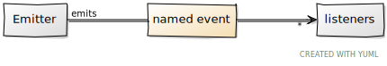
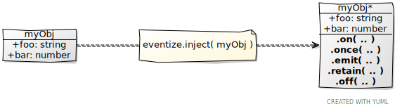
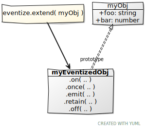

> !!! THIS IS THE DEVELOPMENT BRANCH - ALL STUFF HERE IS BY DEFAULT UNSTABLE - SO PLEASE USE IT WITH CARE !!!

# eventize.js

[](https://www.npmjs.com/package/eventize-js)
[](https://travis-ci.org/spearwolf/eventize)

A tiny and clever framework for synchronous event-driven programming in javascript.

yes, read correctly: the emitters call the listeners here _synchronously_ and not _asynchronously_, as is the case with [node.js events](https://nodejs.org/api/events.html), for example

This is perfectly reasonable: sometimes you want to have control over when something happens. e.g., when your code runs inside an [animation frame](https://developer.mozilla.org/en-US/docs/Web/API/window/requestAnimationFrame). Or you want to release resources immediately and instantaneously.


##### FEATURES

- all **API** calls and downstream-listener-calls are **100% synchronous** :boom: no async! :stuck_out_tongue_closed_eyes:
- :sparkles: **wildcards** &amp; **priorities** :exclamation:
- :rocket: **smart api** (based upon [node.js events](https://nodejs.org/api/events.html))
- has **typescript types** included :tada:
- supports all major browsers and Node.js environments
- very small footsprint ~2.8k gzip'd
- no runtime dependencies
- apache-2.0 license

## Installation

All you need is to install the package:

```sh
$ npm install eventize.js@2.0.0-alpha
```


## Getting Started

The underlying concept is simple: certain kinds of objects (called "emitters") emit named events that cause function "listeners" to be called.



##### Emitter

Every object can become an emitter; for this, the object must inject the eventize API.

```js
import eventize, {Eventize} from 'eventize-js';

const myObj = eventize({});

// or, if you are more familiar with class-based objects

class Foo extends Eventize {
  // constructor() {
  //   super();
  // }
}

const myOtherObj = new Foo();
```

##### Listener

Any function can be used as a listener. However, you can also use an object that defines methods that have the exact name of the given event.

```js
myObj.on('foo', (bar) => {
  console.log('I am a listener function and you called me with bar=', bar);
})

myObj.on('foo', {
  foo(bar, plah) {
    console.log('I am a method and you called me with bar=', bar, 'and plah=', plah);
  }
})
```

##### Named Events

An emitter can emit any event name; parameters are optional

```js
myObj.emit('bar');  // well, nothing happens here

myObj.emit('foo', 123, 456);
// => "I am a listener function and you called me with bar= 123"
// => "I am a method and you called me with bar= 123 and plah= 456"
```

If an emitter emits an event to which no listeners are attached, nothing happens.

_Btw._ an event name can be either a _string_ or a _symbol_


## API

### How to Emitter

There are several ways to convert any object into an emitter.

Probably the most common method is to simply use `eventize( myObj )`; this corresponds to the _inject_ variant:

##### inject

```ts
eventize.inject( myObj )  // => myObj
```

Returns the same object, with the eventize API attached, by modifying the original object.




##### extend

`eventize.extend( myObj )` &rarr; `myEventizedObj`

Returns a new object, with the eventize API attached. The original object is not modified here, instead the _prototype_ of the new object is the orignial object.




---

OLD DOCUMENTATION:

---

## Getting Started

Attach the _eventizer_ **api** to any javascript object you want.

```javascript
import eventize from 'eventize-js';

const say = hello => world => console.log(hello, world);
const obj = eventize({});

obj.on('foo', say('hello'));

obj.once(['foo', 'bar'], Priority.AAA, {
  foo: say('hej'),
});

obj.on(['foo', 'bar'], Priority.Low, say('moin moin'))

obj.emit('foo', 'world');
// => "hej world"
// => "hello world"
// => "moin moin world"

obj.on('foo', () => obj.off('foo'));

obj.emit(['foo', 'bar'], 'eventize');
// => "hello eventize"
// => "moin moin eventize"

```


# API Reference

## The _eventize_ API

### 

```
eventize( obj )  // alias for eventize.inject()

eventize.inject( obj )  // => eventizer === obj
eventize.extend( obj )  // => eventizer (prototype is obj)
eventize.create( obj )  // => eventizer
```

.. or if you like a more class based approach ..

```typescript
import {Eventize} from 'eventize-js';

class Foo extends Eventize {
  // foo has now the eventize superpowers!
}
```


## The _eventizer_ API

### 

```
.on( eventName*, [ priority, ] listenerFunc [, listenerObject] )
.on( eventName*, [ priority, ] listenerFuncName, listenerObject )
.on( eventName*, [ priority, ] listenerObject )

.on( [ priority, ] listenerFunc [, listenerObject] )   => listenerObject.on( '*', listenerFunc )
.on( [ priority, ] listenerObject )                    => listenerObject.on( '*', listenerObject )

eventName*:       eventName | Array<eventName>
eventName:        string

listenerFunc:     function
listenerFuncName: string
listenerObject:   object
```


### 

```
eventizer.once( ... )
```


### 

```
eventizer.emit( eventName* [, args... ] )
```

### 

```
eventizer.off( listenerFunc [, listenerObject] )
eventizer.off( listenerFuncName, listenerObject )
eventizer.off( listenerObject )
eventizer.off( eventName )
eventizer.off()
```

### retain()

```
eventizer.retain( eventName* )
```


## Additional API Helpers

```
eventize.is( obj )
```

Check if `obj` is an _eventizer_ (object has the _eventizer_ **api** implemented). Returns `true` or `false`

```
eventize.Priority.Max
eventize.Priority.AAA
eventize.Priority.BB
eventize.Priority.C
eventize.Priority.Default = 0
eventize.Priority.Low
eventize.Priority.Min
```

Some predefined priorities. Use it or not. They are defined just for convenience.
