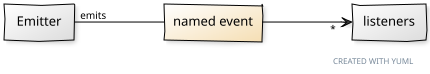

# @spearwolf/eventize

A tiny, clever, and dependency-free library for synchronous event-driven programming in JavaScript and TypeScript.


## Introduction 👀

`@spearwolf/eventize` provides a powerful and intuitive API for building event-based systems. This library invokes event listeners _synchronously_. This design choice gives you precise control over your execution flow, which is critical in scenarios like game loops (`requestAnimationFrame`), real-time applications, or any situation where immediate, predictable execution is necessary.

Written entirely in TypeScript and targeting modern `ES2022`, it offers a robust, type-safe developer experience without sacrificing performance or adding bloat.

### Features

- 🚀 **Developer-Focused API**: Clean, modern, and functional.
- ✨ **Wildcards & Priorities**: Subscribe to all events and control listener execution order.
- 🔷 **Full TypeScript Support**: Leverage strong typing for more reliable code.
- 📦 **Zero Runtime Dependencies**: Lightweight with a minimal footprint (&lt;5k gzipped).
- ESM & CommonJS Support.
- Apache 2.0 Licensed.

## ⚙️ Installation

Install the package using your favorite package manager:

```sh
$ npm install @spearwolf/eventize
```

The library is distributed in both ES Module (`import`) and CommonJS (`require`) formats.

> [!NOTE]
> Since version 3.0.0 there is also a [CHANGELOG](./CHANGELOG.md)

## 📖 Getting Started

The core idea is simple: an object, called an **emitter**, can be "eventized" to emit named events. Other parts of your application, called **listeners**, can subscribe to these events and will be executed immediately when the event is emitted.



Here is a basic example:

```javascript
import {eventize, on, emit} from '@spearwolf/eventize';

// 1. Create an eventized object (the emitter)
const bus = eventize({});

// 2. Subscribe to a 'data' event
on(bus, 'data', (message, code) => {
  console.log(`Received message: ${message} with code ${code}`);
});

// 3. Emit the 'data' event with some arguments
emit(bus, 'data', 'Hello World!', 42);

// Output: Received message: Hello World! with code 42
```

## The Event-Driven Model

### Emitters

An emitter is any object that has been enhanced with event capabilities. The recommended way to create one is with the `eventize()` function.

> [!TIP]
> We often use `ε` (epsilon) as a variable name to denote an _eventized_ object.

```javascript
import {eventize} from '@spearwolf/eventize';

// Create an emitter from a new empty object
const ε = eventize();

// Enhance an existing object
const myApp = {name: 'MyApp'};
eventize(myApp); // myApp is now an emitter
```

### Listeners

A listener can be a simple function or a method on an object. It's the code that runs in response to an event.

```js
on(ε, 'foo', (a) => {
  console.log('(1) Hello', a);
});

on(ε, 'foo', {
  foo(a, b) {
    console.log('(2)', b, a);
  },
});

on(ε, {
  foo(a, b) {
    console.log('(3) Hi', a);
  },
  bar() {
    console.log('(4) hej');
  },
});

emit(ε, 'foo', 'eventize', 'Greetings from');
// => "(1) Hello eventize"
// => "(2) Greetings from eventize"
// => "(3) Hi eventize"

emit(ε, 'bar');
// => "(4) hej"
```

### Events

Events are identified by a name, which can be a `string` or a `symbol`. When an emitter `emit`s an event, it can also pass along data as arguments to the listeners.

```javascript
// Emit a simple event
emit(ε, 'user-login');

// Emit an event with data
emit(ε, 'update', {id: 1, payload: 'new data'});

// Emit an event with multiple arguments
emit(ε, 'hello', 'hi', 'hej', 'hallo');
```

## 📚 API Reference

The API is designed to be used functionally, with named exports like `on(ε, ...)` and `emit(ε, ...)`. For class-based patterns, you can also inject the API methods directly onto an object.

| API           | Description                                                         |
| ------------- | ------------------------------------------------------------------- |
| `on`          | subscribe to events                                                 |
| `once`        | subscribe to the next event only                                    |
| `onceAsync`   | the async version of subscribe only to the next event               |
| `emit`        | dispatch an event                                                   |
| `emitAsync`   | dispatch an event and wait for any promises returned by subscribers |
| `off`         | unsubscribe                                                         |
| `retain`      | hold the last event until it is received by a subscriber            |
| `retainClear` | clear the last event                                                |

### Creating Emitters

There are three main ways to create an emitter.

| Method                      | Is a `EventizedObject`? | Has API Methods Injected? | Recommended For                             |
| --------------------------- | ----------------------- | ------------------------- | ------------------------------------------- |
| `eventize(obj)`             | ✅                      | ❌                        | Functional programming, general use.        |
| `eventize.inject(obj)`      | ✅                      | ✅                        | Object-oriented or class-based composition. |
| `class extends Eventize {}` | ✅                      | ✅                        | Class-based inheritance.                    |

#### `eventize(obj)`

This is the primary and recommended approach. It prepares an object to be used with the functional API.

```typescript
import {eventize, on, emit} from '@spearwolf/eventize';

const ε = eventize(); // Creates an emitter from {}

on(ε, 'foo', () => console.log('foo called'));

emit(ε, 'foo'); // => "foo called"
```

#### `eventize.inject(obj)`

This modifies the object, attaching the entire API as methods.

```typescript
import {eventize} from '@spearwolf/eventize';

const myApp = {name: 'MyApp'};
const obj = eventize.inject(myApp); // Creates and injects the API into myApp

obj.on('foo', () => console.log('foo called'));

obj.emit('foo'); // => "foo called"
```

#### `class extends Eventize`

For traditional object-oriented programming, you can extend the `Eventize` base class.

```typescript
import {Eventize} from '@spearwolf/eventize';

class MyEmitter extends Eventize {}

const obj = new MyEmitter();

obj.on('foo', () => console.log('foo called'));

obj.emit('foo'); // => "foo called"
```

#### Class-based, but without inheritance

If you want to create an class-based emitter object, but not via inheritance, you can also use the eventize.inject method inside the constructor, here as a typescript example:

```ts
import {eventize, Eventize} from '@spearwolf/eventize';

interface Foo extends Eventize {}

class Foo {
  constructor() {
    eventize.inject(this);
  }
}
```

---

### Auto-eventize vs. strict mode (intentional asymmetry)

Eventize splits its API into two families with different behavior on a non-eventized object — this is **by design**, not a quirk:

| Function                                  | On a non-eventized object   |
| ----------------------------------------- | --------------------------- |
| `on()`, `once()`, `onceAsync()`, `retain()` | Auto-eventizes the object   |
| `emit()`, `emitAsync()`, `off()`, `retainClear()` | Throws `"object is not eventized"` |

**Why the split?**

`on` / `once` / `retain` _install_ behavior — they attach hooks, listeners, or a retain policy to an object. Requiring an explicit `eventize(obj)` call before every `on(obj, …)` would be pure ceremony, so these functions auto-eventize as a developer-experience shortcut. Calling `on({}, 'foo', fn)` is a perfectly meaningful intent: _"I want to start listening to events on this object"_.

`emit` / `emitAsync` / `off` / `retainClear` _operate on_ an existing emitter — they fire events, remove subscriptions, or clear retained state. Calling them on a plain `{}` is almost always a bug: nothing has ever been subscribed, no events were ever retained, no state to remove or fire against. Auto-eventizing here would silently turn typos into no-ops (`emit(typoVariable, 'foo')` would just create a new emitter and discard the call). Throwing surfaces the mistake immediately.

```javascript
// ✅ Auto-eventize: convenient, intent is clear
const obj = {};
on(obj, 'foo', () => console.log('foo')); // obj is now eventized
emit(obj, 'foo'); // works

// ❌ Strict: catches the bug instead of silently doing nothing
const plain = {};
emit(plain, 'foo'); // throws: "object is not eventized"
off(plain); // throws: "object is not eventized"
retainClear(plain, 'foo'); // throws: "object is not eventized"
```

The type guard `isEventized(obj)` (see _Utilities_) lets you check defensively if you ever need to. `getSubscriptionCount(obj)` is the one exception that returns `0` for non-eventized inputs instead of throwing — see its section for the rationale.

---

### Subscribing to Events

#### `on(emitter, ...args)`

Subscribes a listener to one or more events. It returns an `unsubscribe` function to remove the subscription.

**Signatures:**

```typescript
on(ε, eventName(s), [priority], listener, [context]);
on(ε, [priority], listener, [context]); // Wildcard subscription
```

**Example (Simple Listener):**

```javascript
const ε = eventize();
const listener = (val) => console.log(val);

const unsubscribe = on(ε, 'my-event', listener);
emit(ε, 'my-event', 'Hello!'); // => "Hello!"

unsubscribe();
emit(ε, 'my-event', 'Silent?'); // (nothing happens)
```

##### Multiple Event Names

Subscribe to several events with one call by passing an array of names.

```javascript
const ε = eventize();
const listener = (val) => console.log(val);

on(ε, ['foo', 'bar'], listener);

emit(ε, 'foo', 1); // => 1
emit(ε, 'bar', 2); // => 2
```

##### Wildcards (`*`)

Listen to _all_ events emitted by an object using the `*` wildcard or by omitting the event name entirely.

```javascript
const ε = eventize();

const wildcardListener = (...args) => {
  console.log('event fired with args:', args);
};

on(ε, '*', wildcardListener); // or just on(ε, wildcardListener)

emit(ε, 'foo', 1, 2); // => event fired with args: [1, 2]
emit(ε, 'bar', 'A'); // => event fired with args: ['A']
```

> [!IMPORTANT]
> A function-form wildcard listener receives **only the `emit()` arguments**. The event name is _not_ passed in. If you need to know which event fired, register a listener-object with an `.emit()` method instead — eventize will fall back to it for events without a matching named method, and pass `eventName` as the first argument:
>
> ```javascript
> on(ε, {
>   emit(eventName, ...args) {
>     console.log(`Event '${eventName}' fired with:`, args);
>   },
> });
>
> emit(ε, 'foo', 1, 2); // => Event 'foo' fired with: [1, 2]
> emit(ε, 'bar', 'A'); // => Event 'bar' fired with: ['A']
> ```

##### Priorities

Control the execution order of listeners. Listeners with higher priority numbers run first. The default priority is `0`.

```javascript
import {eventize, on, emit, Priority} from '@spearwolf/eventize';

const ε = eventize();
const calls = [];

on(ε, 'test', () => calls.push('Default'));
on(ε, 'test', Priority.Low, () => calls.push('Low')); // Runs later
on(ε, 'test', Priority.AAA, () => calls.push('High')); // Runs sooner

emit(ε, 'test');
console.log(calls); // => ["High", "Default", "Low"]
```

`Priority` provides several predefined levels: `Max`, `AAA`, `BB`, `C`, `Default`, `Low`, `Min`.

##### Listener Objects

You can subscribe an object whose method names match the event names.

```javascript
const ε = eventize();
const service = {
  onSave(data) {
    console.log('Saving:', data);
  },
  onDelete(id) {
    console.log('Deleting:', id);
  },
};

// Subscribe the entire object. Methods will be matched to event names.
on(ε, service);

emit(ε, 'onSave', {user: 'test'}); // => "Saving: { user: 'test' }"
emit(ε, 'onDelete', 123); // => "Deleting: 123"
```

##### De-duplication (Listener Objects)

Subscribing the **same listener-object** twice for the same event does _not_ register two listeners — eventize collapses the second call into the existing entry and increments an internal reference count. The listener still fires only once per `emit()`.

```javascript
const ε = eventize();
const listener = {foo: () => console.log('foo')};

on(ε, 'foo', listener);
on(ε, 'foo', listener); // same (event, priority, listener, context) → refCount = 2

emit(ε, 'foo'); // => "foo"  (called once, not twice)
```

The match key is the tuple `(eventName, priority, listener, listenerContext)`. Two subscriptions are considered the same only when all four match.

> [!IMPORTANT]
> De-duplication applies **only to listener-object forms** — `on(ε, eventName, listenerObject)` and the explicit method-name form `on(ε, eventName, 'methodName', listenerObject)`. Plain function listeners are **not** deduplicated: registering the same function twice produces two independent listeners that will both run.
>
> Each unsubscribe decrements the count; the listener is removed only when the count reaches zero. See the **Reference Counting** section under `off()` below for details and a comparison with the function form.

---

#### `once(emitter, ...args)`

Subscribes a listener that will be automatically removed after it is called once. The arguments are the same as for `on()`.

```javascript
const ε = eventize();
const oneTimeListener = () => console.log('This runs only once.');

once(ε, 'my-event', oneTimeListener);

emit(ε, 'my-event'); // => "This runs only once."
emit(ε, 'my-event'); // (nothing happens)
```

> [!NOTE]
> If `once()` is used with multiple event names, the listener is removed after the _first_ of those events is triggered.

---

#### `onceAsync(emitter, eventName | eventName[])`

Returns a `Promise` that resolves with the event's arguments when the event is emitted.

```javascript
const ε = eventize();

async function waitForLoad() {
  console.log('Waiting for data...');
  const data = await onceAsync(ε, 'loaded');
  console.log('Data loaded:', data);
}

waitForLoad();

// Somewhere else in the application...
setTimeout(() => emit(ε, 'loaded', {content: '...'}), 100);
// => Waiting for data...
// => Data loaded: { content: '...' }
```

---

### Unsubscribing

#### `off(emitter, ...args)`

Removes listeners from an emitter. This is the counterpart to `on()` and is useful for cleanup scenarios where you don't have a reference to the original `unsubscribe` function returned by `on()`.

**Signatures:**

| Signature                                 | Description                                                         |
| ----------------------------------------- | ------------------------------------------------------------------- |
| `off(emitter)`                            | Unsubscribes **all** listeners from the emitter.                    |
| `off(emitter, '*')`                       | Same as above—unsubscribes all listeners (named and wildcard).      |
| `off(emitter, eventName)`                 | Unsubscribes all listeners for a specific event (string or symbol). |
| `off(emitter, [eventName1, eventName2])`  | Unsubscribes all listeners for multiple events.                     |
| `off(emitter, listenerFunc)`              | Unsubscribes a specific listener function from all events.          |
| `off(emitter, listenerFunc, context)`     | Unsubscribes a listener function with a specific context.           |
| `off(emitter, listenerObject)`            | Unsubscribes all listeners associated with an object.               |
| `off(emitter, eventName, listenerObject)` | Unsubscribes a listener object from a specific event only.          |

> [!NOTE]
> Calling `off()` on a non-eventized object will throw an error: `"object is not eventized"`.

**Using the Unsubscribe Function:**

The recommended way to unsubscribe is to use the function returned by `on()`:

```javascript
const ε = eventize();
const listener = (val) => console.log(val);

const unsubscribe = on(ε, 'my-event', listener);
emit(ε, 'my-event', 'Hello!'); // => "Hello!"

// Remove the listener using the returned function
unsubscribe();
emit(ε, 'my-event', 'Silent?'); // (nothing happens)
```

Calling the unsubscribe function multiple times is safe—subsequent calls are no-ops.

**Removing All Listeners:**

```javascript
const ε = eventize();

on(ε, 'foo', () => console.log('foo'));
on(ε, 'bar', () => console.log('bar'));
on(ε, (eventName) => console.log('wildcard:', eventName));

// Remove ALL listeners from the emitter
off(ε);
// or equivalently:
off(ε, '*');

emit(ε, 'foo'); // (nothing happens)
emit(ε, 'bar'); // (nothing happens)
```

**Removing Listeners by Event Name:**

```javascript
const ε = eventize();

on(ε, 'foo', () => console.log('foo listener 1'));
on(ε, 'foo', () => console.log('foo listener 2'));
on(ε, 'bar', () => console.log('bar listener'));

// Remove only 'foo' listeners
off(ε, 'foo');

emit(ε, 'foo'); // (nothing happens)
emit(ε, 'bar'); // => "bar listener"
```

You can also remove listeners for multiple events at once:

```javascript
off(ε, ['foo', 'bar']); // Remove listeners for both 'foo' and 'bar'
```

**Removing Listeners by Symbol Event Name:**

```javascript
const ε = eventize();
const MyEvent = Symbol('MyEvent');

on(ε, MyEvent, () => console.log('symbol event'));

off(ε, MyEvent); // Remove listeners for the symbol event
```

**Removing a Specific Listener Function:**

```javascript
const ε = eventize();
const listener = () => console.log('I will be removed');
const other = () => console.log('I will stay');

on(ε, 'foo', listener);
on(ε, 'foo', other);
on(ε, 'bar', listener); // Same listener on different event

// Remove 'listener' from ALL events it was subscribed to
off(ε, listener);

emit(ε, 'foo'); // => "I will stay"
emit(ε, 'bar'); // (nothing happens)
```

**Removing Listener Objects:**

When you subscribe an object as a listener, you can remove all its subscriptions at once:

```javascript
const ε = eventize();
const service = {
  foo() {
    console.log('foo');
  },
  bar() {
    console.log('bar');
  },
};

// Subscribe the service object to events (methods are matched by event name)
on(ε, 'foo', service);
on(ε, 'bar', service);

// Remove all listeners associated with 'service'
off(ε, service);

emit(ε, 'foo'); // (nothing happens)
emit(ε, 'bar'); // (nothing happens)
```

**Removing an Object from a Specific Event:**

```javascript
const ε = eventize();
const objA = {foo: () => console.log('A:foo'), bar: () => console.log('A:bar')};
const objB = {foo: () => console.log('B:foo')};

on(ε, 'foo', objA);
on(ε, 'bar', objA);
on(ε, 'foo', objB);

// Remove objA only from 'foo', keeping its 'bar' subscription
off(ε, 'foo', objA);

emit(ε, 'foo'); // => "B:foo"
emit(ε, 'bar'); // => "A:bar"
```

**Interaction with `retain()`:**

When you call `off()` with an event name, it also clears any retained events for that event:

```javascript
const ε = eventize();

retain(ε, 'status');
emit(ε, 'status', 'loading');

// New listener receives retained event
on(ε, 'status', (s) => console.log('Listener 1:', s));
// => "Listener 1: loading"

// Remove all 'status' listeners AND clear retained event
off(ε, 'status');

// New listener does NOT receive the retained event
on(ε, 'status', (s) => console.log('Listener 2:', s));
// (nothing happens until next emit)
```

**Behavior During Emit:**

If `off()` is called during an `emit()` cycle (e.g., inside a listener), listeners that have already been scheduled to run will still execute:

```javascript
const ε = eventize();

on(ε, 'test', 10, () => console.log('High priority'));
on(ε, 'test', 5, () => {
  console.log('Medium priority');
  off(ε, 'test'); // Remove all 'test' listeners
});
on(ε, 'test', 0, () => console.log('Low priority'));

emit(ε, 'test');
// => "High priority"
// => "Medium priority"
// (Low priority is NOT called because off() removed it before it could run)
```

**Reference Counting:**

When the _same_ listener-object subscription is registered more than once, eventize collapses the duplicates into a single entry with an internal reference count instead of storing two separate listeners. Each subsequent `on()` increments the count; each unsubscribe decrements it. The listener is only really removed when the count drops to zero.

> [!IMPORTANT]
> Reference counting **only applies to listener-object forms**:
>
> - `on(ε, eventName, listenerObject)` — listener is an object whose method matches the event name
> - `on(ε, eventName, 'methodName', listenerObject)` — explicit method-name lookup on a listener object
>
> Plain function listeners (`on(ε, 'foo', fn)` or `on(ε, 'foo', fn, ctx)`) are **not** deduplicated — registering the same function twice produces two independent listeners that will both be invoked on `emit()`.
>
> Two listener-object subscriptions are considered identical when their event name, priority, listener (the object), and listener context all match.

```javascript
const ε = eventize();
const listener = {foo: () => console.log('foo')};

const unsub1 = on(ε, 'foo', listener);
const unsub2 = on(ε, 'foo', listener); // Same listener-object, increases refCount

emit(ε, 'foo'); // => "foo" (called only once — single underlying listener)

unsub1(); // Decreases refCount to 1
emit(ε, 'foo'); // => "foo" (still active)

unsub2(); // refCount drops to 0 → listener is removed
emit(ε, 'foo'); // (nothing happens)
```

Compare with the function form, where each `on()` creates an independent registration:

```javascript
const ε = eventize();
const fn = () => console.log('fn');

on(ε, 'foo', fn);
on(ε, 'foo', fn); // Same function — but a SECOND, separate listener

emit(ε, 'foo');
// => "fn"
// => "fn"  ← called twice
```

---

### Emitting Events

#### `emit(emitter, eventName | eventName[], ...args)`

Dispatches an event synchronously, immediately invoking all subscribed listeners with the provided arguments.

```javascript
const ε = eventize();
on(ε, 'update', (id, data) => console.log(`Item ${id}:`, data));

emit(ε, 'update', 42, {status: 'complete'});
// => "Item 42: { status: 'complete' }"

// Emit multiple events at once
emit(ε, ['update', 'log'], 100, {status: 'multi-event'});
```

---

#### `emitAsync(emitter, ...)`

Emits an event and returns a `Promise` that resolves when all promises returned by listeners have resolved. The promise will resolve with an array of the returned values.

Non-`null` and non-`undefined` return values are collected.

```javascript
const ε = eventize();

on(ε, 'load', () => Promise.resolve('Data from source 1'));
on(ε, 'load', () => 'Simple data');
on(ε, 'load', () => null); // This will be ignored

const results = await emitAsync(ε, 'load');
console.log(results); // => ["Data from source 1", "Simple data"]
```

---

### Error Handling in Listeners

Listeners are dispatched **synchronously**. If a listener throws, the exception propagates out of the `emit()` call (or out of the synchronous portion of `emitAsync()`) — eventize does **not** catch it for you.

Consequences worth knowing:

- **Dispatch is aborted.** Any listeners that haven't run yet for the same `emit()` will _not_ be called. Listeners that already ran are unaffected.
- **The throwing listener stays subscribed.** It is not auto-removed; the next `emit()` will call it again.
- **`retain()` is not updated for that emit.** The retained value is written _after_ all listeners run, so a thrown exception leaves the previously retained value (if any) untouched.

```javascript
const ε = eventize();
const calls = [];

on(ε, 'foo', () => calls.push('first'));
on(ε, 'foo', () => {
  throw new Error('boom');
});
on(ε, 'foo', () => calls.push('third')); // not reached

try {
  emit(ε, 'foo');
} catch (err) {
  console.error(err.message); // => "boom"
}

console.log(calls); // => ["first"]
```

**Recommendation:** if a single listener's failure should not stop dispatch to the others, wrap that listener's body in `try/catch` yourself. Eventize deliberately keeps no global error handler so that error policy stays explicit at each subscription site.

```javascript
on(ε, 'foo', (...args) => {
  try {
    riskyWork(...args);
  } catch (err) {
    reportError(err);
  }
});
```

> [!NOTE]
> `emitAsync()` aggregates listener return values into a single `Promise.all`. A listener returning a **rejected promise** will reject the awaited result, but other listeners — being dispatched synchronously — have already run by then. A listener that throws synchronously, however, still aborts dispatch in the same way as with `emit()`.

---

### State Management

#### `retain(emitter, eventName | eventName[])`

Tells an emitter to "hold onto" the last-emitted event and its data. When a new listener subscribes, it will immediately be called with the retained event data. This is similar to a `ReplaySubject(1)` in RxJS.

**Key Behaviors:**

- Calling `retain()` on a non-eventized object will automatically eventize it.
- Only the **last** emitted event is retained (subsequent emissions overwrite the previous value).
- Retained events are delivered to new subscribers immediately upon subscription.
- Retained events maintain their original emission order when multiple events are retained.
- Works with both string and symbol event names.

**Basic Usage:**

```javascript
import {eventize, retain, emit, on} from '@spearwolf/eventize';

const ε = eventize();

// Retain the last 'status' event
retain(ε, 'status');

// Emit a status update before any listeners are subscribed
emit(ε, 'status', 'ready');

// Now, subscribe a new listener
on(ε, 'status', (currentStatus) => {
  console.log(`Status is: ${currentStatus}`);
});
// The new listener fires immediately => "Status is: ready"

// Emitting again notifies existing listeners
emit(ε, 'status', 'running'); // => "Status is: running"
```

**Retaining Multiple Events:**

```javascript
const ε = eventize();

// Retain multiple events at once
retain(ε, ['config', 'user', 'theme']);

emit(ε, 'config', {debug: true});
emit(ε, 'user', {name: 'Alice'});
emit(ε, 'theme', 'dark');

// New subscriber receives all retained events in emission order
on(ε, {
  config(cfg) {
    console.log('Config:', cfg);
  },
  user(u) {
    console.log('User:', u);
  },
  theme(t) {
    console.log('Theme:', t);
  },
});
// => "Config: { debug: true }"
// => "User: { name: 'Alice' }"
// => "Theme: dark"
```

**Using with Symbol Event Names:**

```javascript
const ε = eventize();
const AUTH_STATE = Symbol('authState');

retain(ε, AUTH_STATE);
emit(ε, AUTH_STATE, {authenticated: true, user: 'admin'});

on(ε, AUTH_STATE, (state) => {
  console.log('Auth state:', state);
});
// => "Auth state: { authenticated: true, user: 'admin' }"
```

**Using with `once()` and `onceAsync()`:**

Retained events work with `once()` and `onceAsync()`, triggering the listener immediately if a retained value exists.

```javascript
const ε = eventize();

retain(ε, 'initialized');
emit(ε, 'initialized', {ready: true});

// The once listener fires immediately with the retained value
once(ε, 'initialized', (data) => {
  console.log('Initialized:', data);
});
// => "Initialized: { ready: true }"

// Works with async/await too
const result = await onceAsync(ε, 'initialized');
console.log(result); // => { ready: true }
```

**Important Notes:**

- Events emitted **before** calling `retain()` are not stored.
- Calling `retain()` multiple times for the same event is safe (idempotent).
- Retained events replay to **new** listeners upon subscription, including new wildcard (`*`) listeners subscribing to retained events.

---

#### `retainClear(emitter, eventName | eventName[])`

Clears a retained event. The `retain` behavior remains active for future events, but the currently stored event is discarded. New listeners will not receive the cleared event, but future emissions will be retained.

**Key Behaviors:**

- Does NOT disable the retain behavior—only clears the currently stored value.
- Throws an error if called on a non-eventized object.
- Works with both string and symbol event names.
- Can clear multiple events at once by passing an array.
- Clearing a non-existent or already-cleared event is safe (no-op).

**Basic Usage:**

```javascript
import {eventize, retain, retainClear, emit, on} from '@spearwolf/eventize';

const ε = eventize();

retain(ε, 'status');
emit(ε, 'status', 'loading');

// First subscriber receives the retained value
on(ε, 'status', (s) => console.log('Subscriber 1:', s));
// => "Subscriber 1: loading"

// Clear the retained event
retainClear(ε, 'status');

// New subscriber does NOT receive anything immediately
on(ε, 'status', (s) => console.log('Subscriber 2:', s));
// (nothing happens)

// New emissions are still retained
emit(ε, 'status', 'complete');
// => "Subscriber 1: complete"
// => "Subscriber 2: complete"

// Another new subscriber receives the newly retained value
on(ε, 'status', (s) => console.log('Subscriber 3:', s));
// => "Subscriber 3: complete"
```

**Clearing Multiple Events:**

```javascript
const ε = eventize();

retain(ε, ['event1', 'event2', 'event3']);

emit(ε, 'event1', 'data1');
emit(ε, 'event2', 'data2');
emit(ε, 'event3', 'data3');

// Clear multiple events at once
retainClear(ε, ['event1', 'event2']);

// event1 and event2 are cleared, but event3 remains
on(ε, {
  event1() {
    console.log('event1');
  }, // Not called
  event2() {
    console.log('event2');
  }, // Not called
  event3() {
    console.log('event3');
  }, // => "event3"
});
```

**Error Handling:**

```javascript
const plainObj = {};

// This will throw an error
try {
  retainClear(plainObj, 'foo');
} catch (e) {
  console.error(e.message); // => "object is not eventized"
}

// Use eventize() first, or use retain() which auto-eventizes
const ε = eventize(plainObj);
retainClear(ε, 'foo'); // Now this works
```

---

### Utilities

#### `isEventized(obj)`

A type guard that returns `true` if an object has been processed by `eventize()`.

```javascript
import {eventize, isEventized} from '@spearwolf/eventize';

const obj1 = eventize();
const obj2 = {};

console.log(isEventized(obj1)); // => true
console.log(isEventized(obj2)); // => false
```

#### `getSubscriptionCount(emitter)`

Returns the total number of active subscriptions on an emitter (named listeners + wildcard listeners). Useful for debugging, testing, or verifying that cleanup actually happened.

```javascript
import {eventize, on, off, getSubscriptionCount} from '@spearwolf/eventize';

const ε = eventize();

on(ε, 'foo', () => {});
on(ε, 'bar', () => {});
on(ε, '*', () => {}); // wildcard listeners are counted too

console.log(getSubscriptionCount(ε)); // => 3

off(ε);

console.log(getSubscriptionCount(ε)); // => 0
```

**Edge cases worth knowing:**

- Calling it on a **non-eventized** object returns `0` — it does not throw, unlike `emit()` / `off()` / `retainClear()`. This makes it safe to call on any input you might receive.

  ```javascript
  getSubscriptionCount({}); // => 0
  getSubscriptionCount([]); // => 0
  getSubscriptionCount(new Date()); // => 0
  ```

- A **wildcard listener-object** counts as a _single_ subscription, no matter how many event-named methods it exposes. Dispatch happens at `emit()` time by looking up `listener[eventName]`.

  ```javascript
  const ε = eventize();
  on(ε, {foo() {}, bar() {}, baz() {}});
  getSubscriptionCount(ε); // => 1, not 3
  ```

- Subscriptions that share an underlying entry through reference counting (see _Reference Counting_ under `off()`) count as **one** subscription, not as the number of `on()` calls:

  ```javascript
  const ε = eventize();
  const listener = {foo() {}};
  on(ε, 'foo', listener);
  on(ε, 'foo', listener); // refCount=2 on the same entry
  getSubscriptionCount(ε); // => 1
  ```

- A `once()` listener counts as a normal subscription until it fires; afterwards the count drops by one.
